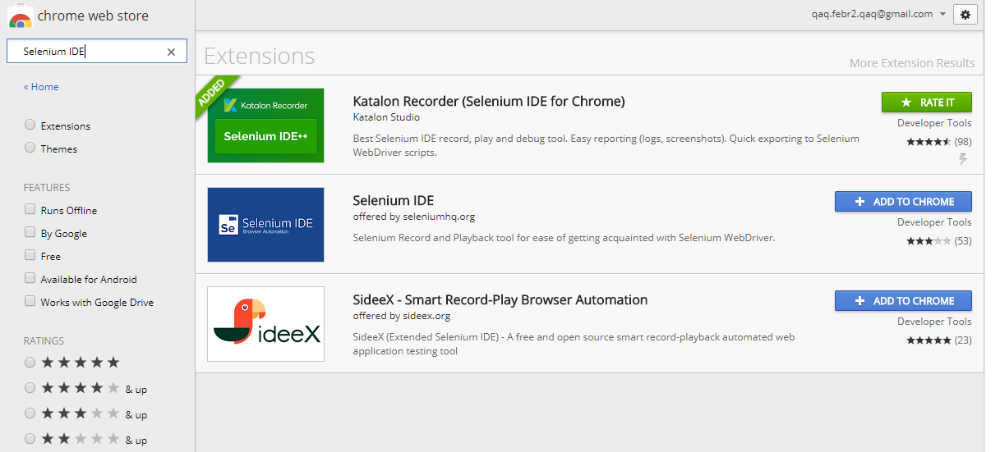
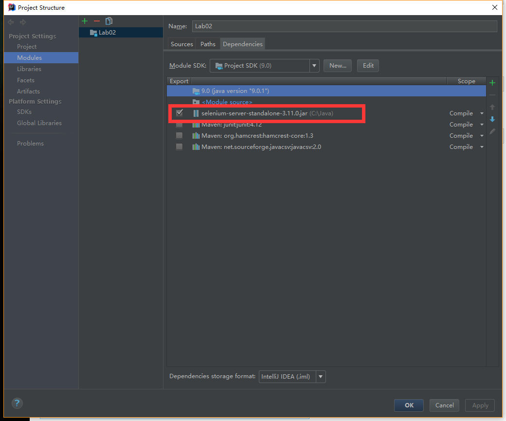
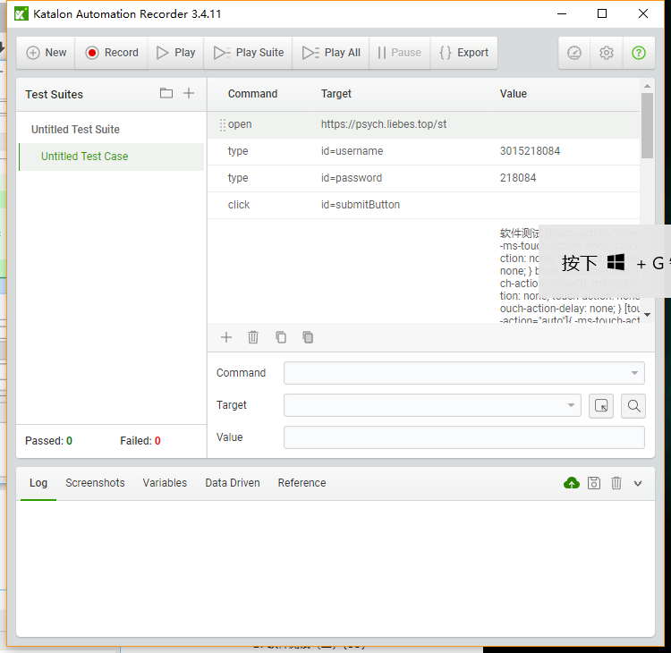
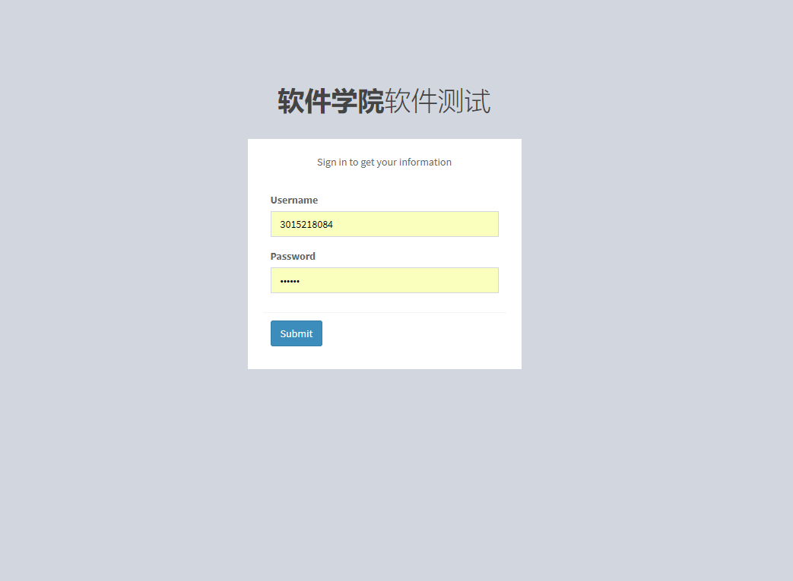
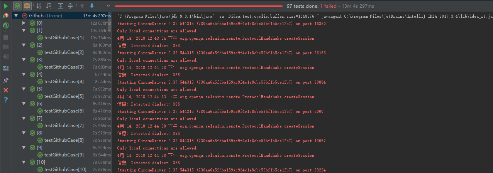

* 安装 Selenium IDE for Chrome

  * 进入 chrome web store 搜索 Selenium IDE，下载第一个插件：

  

* 在 IDEA 中配置 Selenium WebDriver 环境

  * 打开 project structure，在 Dependencies 一栏中选择下载好的 chrome web driver 的路径地址

    

* 使用 Selenium IDE  录制脚本

  * 打开IDE

    

  * 进入网页，开始录制

    

* 最后编写代码，完成整个测试：

  ```java
  package Drone;

  import java.io.IOException;
  import java.nio.charset.Charset;
  import java.util.Arrays;
  import java.util.Collection;
  import java.util.regex.Pattern;
  import java.util.concurrent.TimeUnit;

  import com.beust.jcommander.Parameter;
  import org.junit.*;
  import static org.junit.Assert.*;
  import static org.hamcrest.CoreMatchers.*;

  import org.junit.runner.RunWith;
  import org.junit.runners.Parameterized;
  import org.openqa.selenium.*;
  import org.openqa.selenium.chrome.ChromeDriver;
  import org.openqa.selenium.support.ui.Select;

  import com.csvreader.CsvReader;

  @RunWith(Parameterized.class)
  public class Github {
      private WebDriver driver;
      private String baseUrl;
      private boolean acceptNextAlert = true;
      private StringBuffer verificationErrors = new StringBuffer();
      private String id, pwd, ans;

      public Github(String id, String ans){
          this.id = id;
          this.pwd = id.substring(4);
          this.ans = ans;
      }

      @Before
      public void setUp() throws Exception {
          driver = new ChromeDriver();
          baseUrl = "https://psych.liebes.top/st";
          driver.manage().timeouts().implicitlyWait(30, TimeUnit.SECONDS);
      }

      @Parameterized.Parameters
      public static Collection<Object[]> getData() throws IOException {
          Object[][] obj = new Object[97][];
          CsvReader reader = new CsvReader("D:\\Note\\Lesson\\大三下\\软件测试\\实验\\Lab2\\input.csv", ',', Charset.forName("GBK"));

          int cnt = 0;
          reader.readHeaders();
          while(reader.readRecord()){
              obj[cnt] = new Object[]{reader.get(0), reader.get(1)};
              cnt++;
          }
          return Arrays.asList(obj);

      }

      @Test
      public void testGithubCase() throws Exception {
          driver.get(baseUrl + "/");
          driver.findElement(By.id("username")).clear();
          driver.findElement(By.id("username")).sendKeys(this.id);
          driver.findElement(By.id("password")).clear();
          driver.findElement(By.id("password")).sendKeys(this.pwd);
          driver.findElement(By.id("submitButton")).click();
          assertEquals(this.ans, driver.findElement(By.xpath("/html/body/div/div[2]/a/p")).getText());
      }

      @After
      public void tearDown() throws Exception {
          driver.quit();
          String verificationErrorString = verificationErrors.toString();
          if (!"".equals(verificationErrorString)) {
              fail(verificationErrorString);
          }
      }

      private boolean isElementPresent(By by) {
          try {
              driver.findElement(by);
              return true;
          } catch (NoSuchElementException e) {
              return false;
          }
      }

      private boolean isAlertPresent() {
          try {
              driver.switchTo().alert();
              return true;
          } catch (NoAlertPresentException e) {
              return false;
          }
      }

      private String closeAlertAndGetItsText() {
          try {
              Alert alert = driver.switchTo().alert();
              String alertText = alert.getText();
              if (acceptNextAlert) {
                  alert.accept();
              } else {
                  alert.dismiss();
              }
              return alertText;
          } finally {
              acceptNextAlert = true;
          }
      }
  }
  ```

* 实验结果：

  * 学号为 3015218150 的 github 地址为空，所以有一个测试样例失败

    